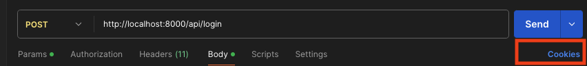
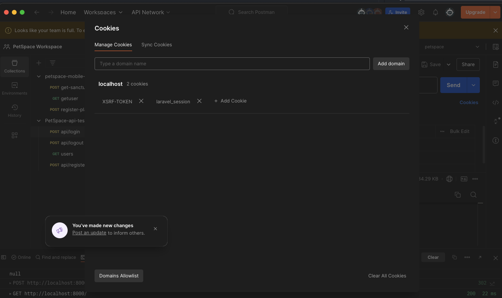
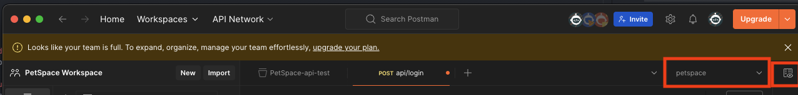
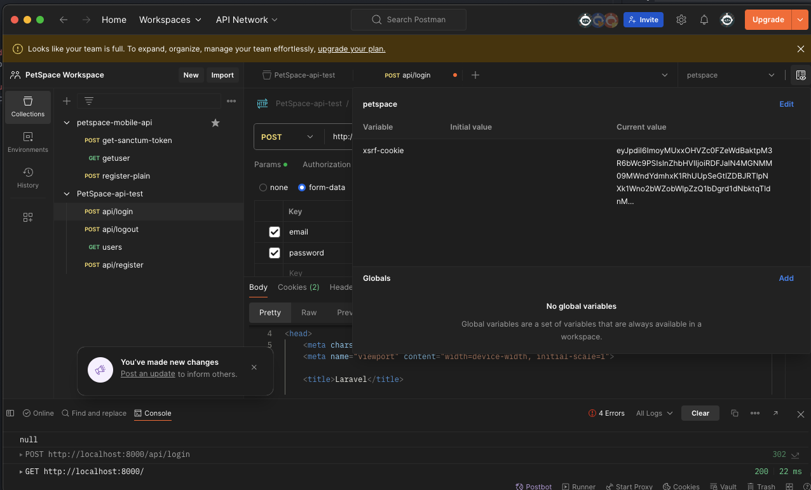
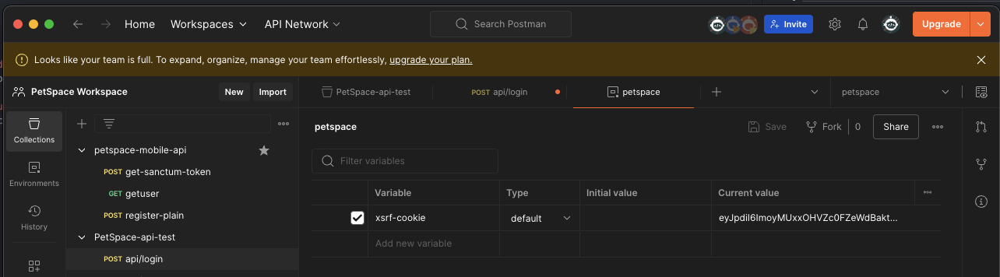
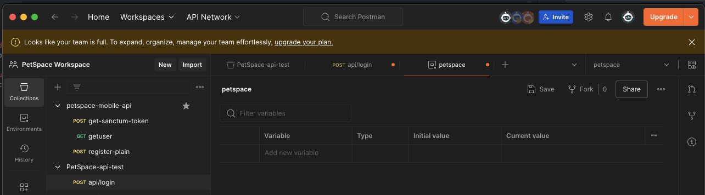

# Debugging Postman API setup
Some issues I have encountered

## XSRF Token mismatch Scenario 1
Missing cookie? 

### Findings
- there could be old cookies stored in the cookies section or the environment variables tab

### Possible Solution:
*Tldr: this will just clear every cookies Postman has*
1. __Clear request cookies__  
    * Check cookies tab by clicking the cookies button
    

    * cookies window should be displayed. Clear all of the cookies in this window
    

2. __Empty environment variables__ 
    * Check if there is are xsrf token variables stored by clicking the environment variable preview button
    
    
    * Check if there is are xsrf token variables stored by clicking the environment variable preview button, if there is, click the edit button
    

    * after clicking the edit button, the environment editor should show up. delete the variable from there.
    

    * after deleting the variable, the environment editor should be empty
    

